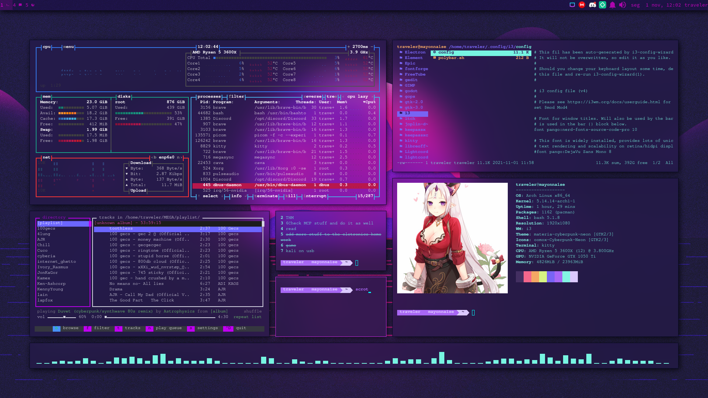
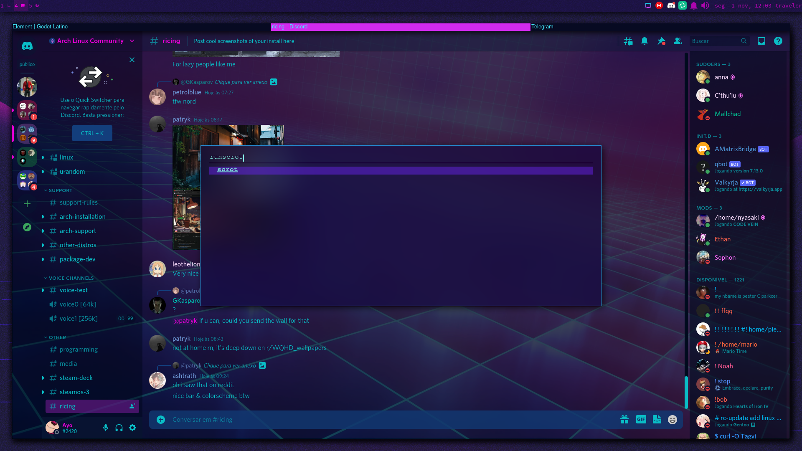

<pre> __  __                                     _            ____   ____ 
|  \/  | __ _ _   _  ___  _ __  _ __   __ _(_)___  ___  |  _ \ / ___|
| |\/| |/ _` | | | |/ _ \| '_ \| '_ \ / _` | / __|/ _ \ | |_) | |    
| |  | | (_| | |_| | (_) | | | | | | | (_| | \__ \  __/ |  __/| |___ 
|_|  |_|\__,_|\__, |\___/|_| |_|_| |_|\__,_|_|___/\___| |_|    \____|
              |___/                                                   
                      
                     
</pre>
<pre>
 D O T F I L E S
</pre>

<h4> What is it? </h4>

 This repository contains the dotfiles for my i3-gaps arch setup, it has configs for a picom fork with dual kawase blur, kitty, i3-gaps, polybar, ranger, bpytop, some crazy scritps, and other stuff.

<h4> Images: </h4>

 
 
<h4>How do i install it?</h4>
 

If you want to install it you can just clone the repository and use your aur helper to install all the packages in PC-packages.txt, after that, just replace the config files in your home directory with the new stuff and everything should work.

<h4> ToDo:</h4>
<ul>
  <li><del>update readme</del></li>
  <li>Create bash script for installation</li>
  <li><del>Remove some of my personal stuff from the repo later</del></li>
  <li>Finish bash script that changes volume of the active window</li>
  <li>Create musikcube bash script for polybar with xdotools, sed and etc...</li>
  <li>Change i3 keybindings to be more vim-like</li>
  <li>Add a list of browser extensions i use</li>
  <li>clean all config files that look like frankenstein</li>
</ul>

