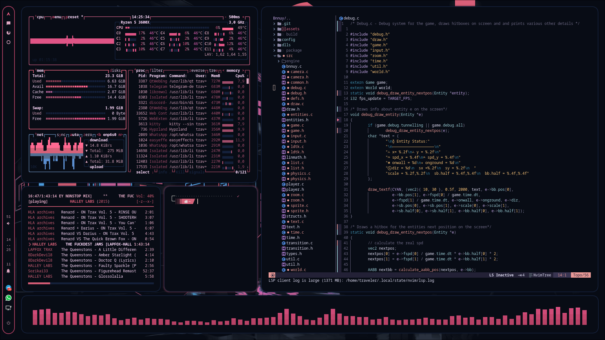
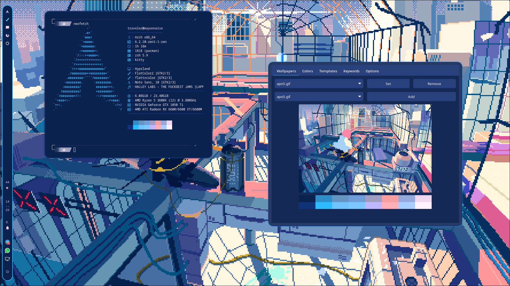

# Vivianne's Hyprland Dotfiles
A Hyprland wpgtk based config, it's colour pallete will adapt to the wallpaper.

<hr>






This repository contains the dots for my Arch Linux Setup, currently it has:

* WM's : 
  * Hyprland
  
* Bar/Menus :
  * Waybar
  * wofi and rofi
  * quickmedia (Quickly download stuff and check some websites ) 
  * Swaync

* Themes : 
  * wpgtk (generates color palette from selected wallpaper and updates all configurations accordingly)
  * FlattrColor (icon theme for gtk )
  * ePapirus (icon theme used by rofi and polybar)
  * FlatColor2 (gtk theme)
  * bibata-cursor-theme-bin (cool rainbow cursors lol)

* System Utils:
	* pipewire (Sound Software)
	* pavucontrol (gui to change audio stuff)
	* EasyEffects (Filters to improve your mic audio)
	* nohang (kills processes that aren't responding)
	* ananicy (auto nice deamon that automatically set's processes priorities )
	* nm-applet (network management tray icon)
	* sddm (display manager)
  
* CLI Programs :
	* kitty (terminal)
	* lvim ( Lunar Vim, an ide layer over vim)
	* btop (Haha look at my cool linux rice)
	* ranger (File explorer, aliased to r)
	* xplr (Faster file explorer, aliased to x)
	* ncmpcpp (music player, aliased to n)
	* cava (Audio Visualizer)
	* termdown (simple countdown timer)
	* calcurse ( ncurses based calendary)
	* blesh (syntax highligting better autocomplete and nvim on bash)
	* scrcpy (can be used to screencast android to pc)

* GUI Programs : 
	* Social stuff:
		* vencord (discord client)
		* Postybirb (Manage various social media )
	* Gaming : 
		* steam-runtime
		* minecraft (both original and prism launcher)
	* Creative Tools : 
		* ManusKript (Novel writing software)
		* Obsidian (markdown notetaking)
		* Krita (art software)
		* Onlyoffice 
		* Audacity
		* Blender
	* General Stuff:
		* Firefox
		* Librewolf 
		* Syncthing
		* iriun webcam (use your phone as a webcam)
		* mpv (media player)
		* zathura (view pdfs)
		* Thunar file manager
		* qbittorrent
		* BleachBit (system cleaning util)
		* KeePassXC ( password manager)

***

### Installation
if you use something else than just change it in the following command.

```bash
# Cloning the repo, will overwrite you local configs
git clone --bare <git-repo-url> $HOME/.cfg
alias dotfiles='/usr/bin/git --git-dir="$HOME/.cfg/" --work-tree="$HOME"'
dotfiles checkout -f
dotfiles config --local status.showUntrackedFiles no

# Downloading the needed packages (+ some extra stuff you might not use)
paru -S --needed $(echo ~/gitdotfiles/PC-Packages.txt)

# Update WPGTK Symlinks, add WPGTK wallpapers, and generate a colorscheme
$XDG_CONFIG_HOME/wpg/fix-symlinks.sh
wpg -a $XDG_CONFIG_HOME/Wallpapers/*
wpg -A $(wpg -l)

```
make sure you enable sddm and have files with correct permissions, then reboot.

***

### ToDo:
- [ ] Remove unecessary files 
- [ ] Clear Scripts and re-organize files
- [ ] Create scripts for a backup system
- [ ] Separate Personal configuration files in another repo (example, yt-dlp downloaded list).
- [ ] Create Package list with only the needed packages for this to run.
- [ ] Update this readme more
- [ ] Create Keybind list in Readme
- [ ] Create Eww widgets
- [ ] Create a bar with Eww
- [ ] finish bash script that changes volume of the active window // unused
- [x] fix lvim colorscheme -> done i think?

