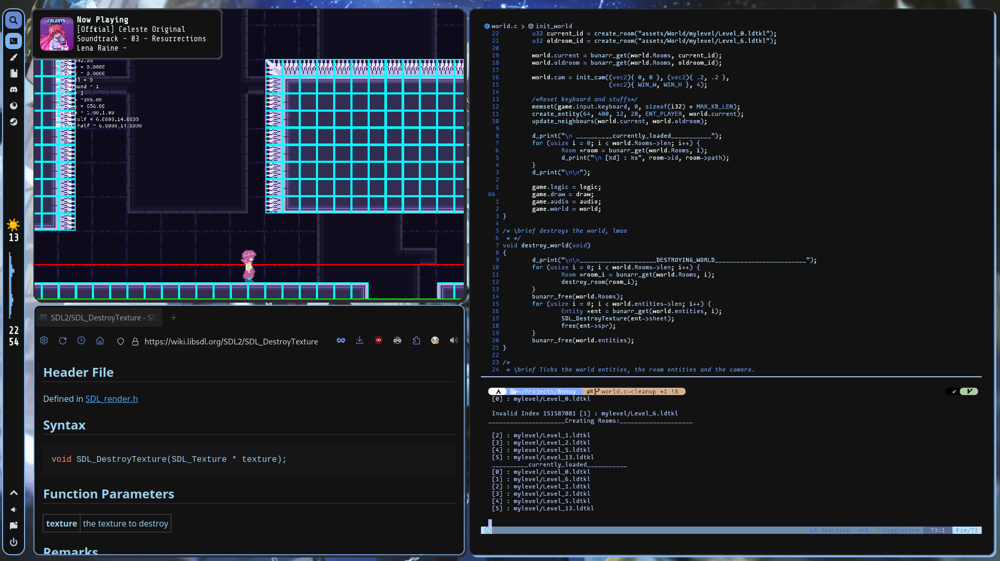
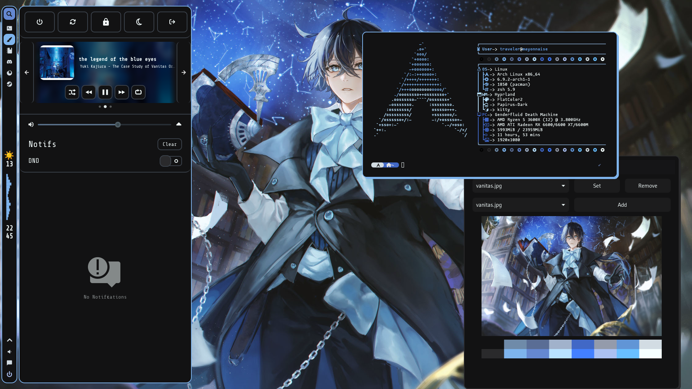

<pre> __  __                                     _            ____   ____ 
|  \/  | __ _ _   _  ___  _ __  _ __   __ _(_)___  ___  |  _ \ / ___|
| |\/| |/ _` | | | |/ _ \| '_ \| '_ \ / _` | / __|/ _ \ | |_) | |    
| |  | | (_| | |_| | (_) | | | | | | | (_| | \__ \  __/ |  __/| |___ 
|_|  |_|\__,_|\__, |\___/|_| |_|_| |_|\__,_|_|___/\___| |_|    \____|
              |___/                                                   
                      
                     
</pre>
<pre>
 D O T F I L E S
</pre>

This repository contains the dots for my Arch Linux Setup, currently it has:

* WM's : 
  * i3-gaps
  * Hypr (Outdated configs)
  
* Bar/Menus :
  * Xborders (active window border replacement that has rounded corner)
  * Polybar
  * rofi
  * quickmedia (Quickly download stuff and check some websites ) 

* Themes : 
  * wpg (generates color palette from selected wallpaper and updates all configurations accordingly)
  * lxappearance (Theme selector)
  * FlattrColor (icon theme for gtk )
  * ePapirus (icon theme used by rofi and polybar)
  * FlatColor (gtk theme)
  * bibata-rainbow-cursors (cool rainbow cursors lol)

* System Utils:
  * pipewire (Sound Software)
  * pavucontrol (gui to change audio stuff)
  * EasyEffects (Filters to improve your mic audio)
  * nohang (kills processes that aren't responding)
  * ananicy (auto nice deamon that automatically set's processes priorities )
  * nm-applet (network management tray icon)
  * sddm (display manager)
  
* CLI Programs :
  * kitty (terminal)
  * Alacritty (extra terminal, just in case)
  * lvim ( Lunar Vim, an ide layer over vim)
  * bpytop (haha look at my cool linux rice)
  * ranger (with devicons and dragon-drop)
  * ncmpcppi (ncmpcpp with ueberzugs scritps to display album covers)
  * cava (Audio Visualizer)
  * todo ( Simple todo list)
  * termdown (simple countdown timer)
  * calcurses ( ncurses based calendary)
  * unzip (easy unzip command)
  * scrcpy (screencast android screen to pc)

* GUI Programs : 
  * Social stuff:
    * Telegram (yeeeah)
    * Whatsapp (yeah the zuck can see my system )
    * Discord (with betterdiscord )
    * Discover-overlay (Discord overlay everywhere)
    * Postybirb (Manage various social media )
  * Gaming : 
    * steam-runtime
    * minecraft (both original and technic launcher)
    * Lutris
  * Creative Tools : 
    * ManusKript (Novel writing software)
    * Joplin (markdown note taking and todo list)
    * Krita (art software)
    * Shotcut (video editor)
    * Onlyoffice office sweet
    * Audacity
  * General Stuff:
    * Brave Browser
    * MegaSync 
    * DroidCam (use your phone as a webcam)
    * mpv (media player)
    * zathura (view pdfs)
    * Thunar file manager
    * qbittorrent
    * Arandr (screen configs)
    * OpenRGB (configure rgb stuff)
    * BleachBit (system cleaning util)
    * KeePassXC ( password manager)
    * Buttercup ( password manager)

#

***
#### How do i install it?
If you want to install it you can just clone the repository and use your aur helper to install all the packages in PC-packages.txt.
After that, just copy everything and paste it in your home folder

***

### ToDo:
- [ ] change polybar stuff position
- [ ] change mpc keybinds to use keyboard media keys
- [ ] Clear Scripts and re-organize files
- [ ] Add theme to rofi shutdown menus
- [ ] Create Keybind list in Readme
- [ ] Create bash script for installation
- [ ] Create Eww widgets
- [ ] Create a bar with Eww
- [ ] Switch to HyprLand?
- [ ] finish bash script that changes volume of the active window
- [ ] add a list of browser extensions i use
- [x] remove unecessary dependencies
- [x] start using wpgtk to manage themes
- [x] update readme further
- [x] remove some of my personal stuff from the repo later
- [x] remove unecessary files
- [x] add eww config
- [x] update notification theme

